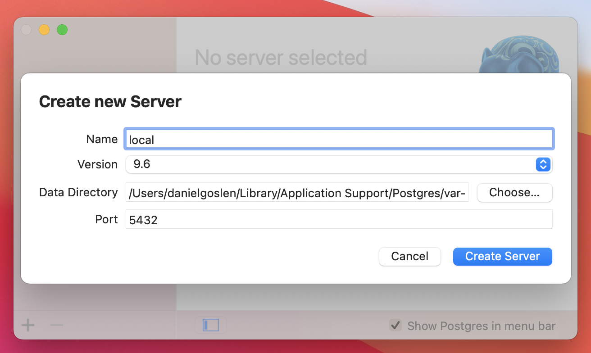
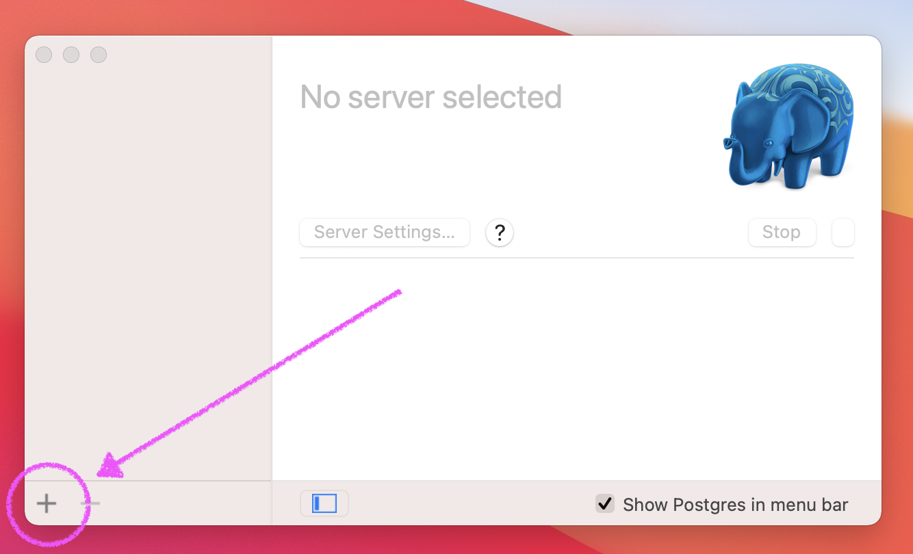
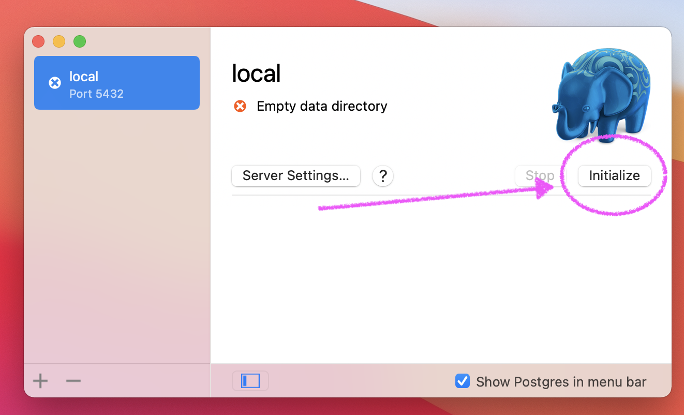
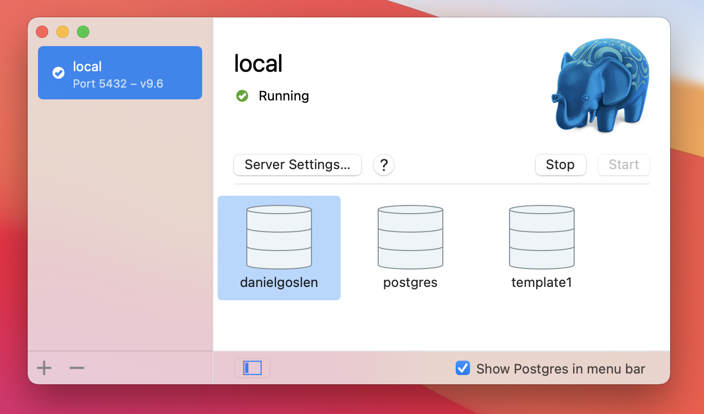

# Starting Postgresql

Since postgresql@9.6 is EoL and deprecated by Homebrew, an alternative is to use the PostgresApp. The app comes bundled with a handful of versions of postrgresql. 

## Initializing a 9.6 DB

After installing the app via the [mac.sh](./mach.sh) script, you will need to initialize the DB manually. Follow this guide for how to do that.

1. Open the PostgresApp however you like. It should be in your `/Applications` directory

2. Select the `+` button on the bottom left of the Left Sidebar

3. Name the server `local` (or whatever name you want) and then choose `9.6` for the version

4. Click `Create Server`

5. Click `Initialize`

6. You're Done!

